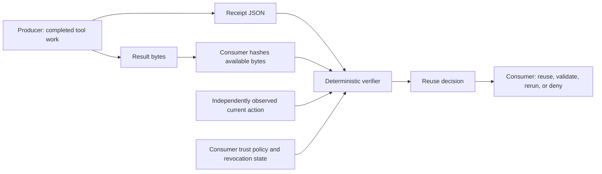

# Oncefold

[](CHANGELOG.md)
[](LICENSE)
[](pyproject.toml)

**Portable reuse evidence for agent tools.**

Oncefold is an open [protocol](docs/PROTOCOL.md) and Python reference
implementation for evaluating whether previously produced tool work remains
eligible for reuse under current dependencies, scope, validator rules,
revocation state, and result integrity. Its language-neutral
[conformance suite](docs/CONFORMANCE.md) lets independent consumers implement
the same deterministic decisions.

Oncefold is not a general-purpose agent cache and does not make arbitrary
AI-generated output trustworthy.

> **Experimental pre-1.0 protocol.** Suitable for review, local integration,
> and conformance work—not a public trust service, signed attestation system,
> or production shared cache. The package version is **0.1.0**; subsequent
> repository changes are tracked under **Unreleased** in the
> [changelog](CHANGELOG.md). No PyPI installation is assumed below.

## Why a receipt?

A result digest alone proves only that some bytes match. A Oncefold receipt binds
that result to a deterministic [Action Identity](docs/PROTOCOL.md#3-action-identity):
the operation, version, inputs, declared dependencies, environment, trust scope,
validator contract, and side-effect class. A consumer can then make a small
deterministic decision without trusting the producer's prose or importing the
producer's storage.

Use this when a tool runner needs to hand completed-work evidence to another
component, or when independent implementations need to agree on reuse eligibility.
Use a normal cache instead when a single application already owns its keys,
validation rules, and storage and has no need to exchange reuse evidence.

## How it fits together



The producer supplies evidence, not permission. The consumer supplies **current
facts and trust policy independently**, verifies the available result's digest,
and decides what to do with the verifier's state. A receipt's producer label is
not authentication. Storage and transport are replaceable; see the
[architecture](docs/ARCHITECTURE.md) and [trust model](docs/THREAT_MODEL.md).

## Quickstart: producer → receipt file → consumer

Requires Git and Python **3.11+** available as `python`. The runtime package has
**zero third-party dependencies**; installation may download build tooling.
Run one block below from a directory where `Oncefold` does not already exist.
No API key, model, account, network service, or developer dependencies are needed
to run the example after installation.

**Linux / macOS / POSIX shell:**

```sh
git clone https://github.com/Smkzz/Oncefold.git
cd Oncefold
python -m venv .venv
.venv/bin/python -m pip install .
.venv/bin/python examples/interop_cli_producer.py .tmp/quickstart/receipt.json
.venv/bin/python examples/interop_consumer.py .tmp/quickstart/receipt.json --action-output .tmp/quickstart/current-action.json
```

<details>
<summary><strong>Windows PowerShell: complete copy-paste block</strong></summary>

```powershell
git clone https://github.com/Smkzz/Oncefold.git
cd Oncefold
python -m venv .venv
.\.venv\Scripts\python.exe -m pip install .
.\.venv\Scripts\python.exe examples/interop_cli_producer.py .tmp/quickstart/receipt.json
.\.venv\Scripts\python.exe examples/interop_consumer.py .tmp/quickstart/receipt.json --action-output .tmp/quickstart/current-action.json
```

These commands use the virtual environment directly; PowerShell activation and
execution-policy changes are unnecessary.

</details>

After the usual clone/install output, the consumer prints:

<!-- quickstart-output -->
```json
{"reason": "identity and dependencies match", "state": "REUSABLE_EXACT"}
```

The consumer exits **0**. You now have three inspectable artifacts in
`.tmp/quickstart/`:

| File | Produced by | Contents |
| --- | --- | --- |
| `receipt.json` | Producer | Portable Action Identity, result digest, provenance, and receipt digest. |
| `receipt.result.txt` | Producer | Exact UTF-8 result bytes: `cli-producer-result` (no trailing newline). |
| `current-action.json` | Consumer | Independently reconstructed current action—not an action copied from the receipt. |

This is a deterministic **local fixture**, not a real catalog integration. The
producer records a supplied lookup result; it does not prove that result is
semantically correct. The consumer independently uses the demo input
`example-cli-input`, operation `example.cli.lookup` version `1`, and local trust
configuration, and hashes the saved result bytes before evaluating reuse.
The fixture's fixed timestamp makes its receipt reproducible; it is not a
freshness guarantee.

### See it fail closed

Run the consumer again for a different current input. It must not reuse the old
receipt. Use `.\.venv\Scripts\python.exe` instead of `.venv/bin/python` on Windows.

```sh
.venv/bin/python examples/interop_consumer.py .tmp/quickstart/receipt.json --input changed-input
```

Expected output, with exit code **1**:

```json
{"reason": "action identity mismatch", "state": "STALE"}
```

Changing the result file instead produces `UNKNOWN` / `result digest mismatch`
and exit **1**. A missing result file or malformed receipt produces `UNKNOWN`
and exit **2**. Nothing executes or replays the underlying tool automatically.
See the [example guide](examples/README.md) for custom inputs, result paths, and
trust limitations, or run `python examples/basic.py` in an installed environment
for the small in-memory Python API example.

## Verifier states and CLI exit codes

These are all eight [protocol decision states](docs/PROTOCOL.md#6-decision-algorithm).
The table describes a **successfully parsed evaluation**. `check` and its
compatibility alias `verify` are gates; `inspect` reports a decision but is
**never a success/failure gate**.

| State | Meaning | `check` / `verify` exit | `inspect` exit |
| --- | --- | ---: | ---: |
| `REUSABLE_EXACT` | Evidence passes the configured identity, dependency, integrity, and trust checks; any required validator has passed. | 0 | 0 |
| `REQUIRES_VALIDATION` | A `VERIFIED` receipt still needs a matching current validator. Do not reuse yet. | 1 | 0 |
| `ADVISORY_ONLY` | Context only; never authority to reuse. | 1 | 0 |
| `STALE` | Current action or dependency facts differ, or a current validator rejected the receipt. | 1 | 0 |
| `REVOKED` | The receipt has been revoked. Do not reuse. | 1 | 0 |
| `SCOPE_MISMATCH` | Trust scope or authorization scope differs. | 1 | 0 |
| `UNSAFE` | The action is not read-only or the receipt is explicitly unsafe. | 1 | 0 |
| `UNKNOWN` | Evidence is insufficient, incomplete, untrusted, or has a result-integrity mismatch. Fail closed. | 1 | 0 |

**Input/usage errors override the table:** unreadable or malformed JSON, invalid
policy arguments, and missing required gate arguments exit **2**, including for
`inspect`. Parsing/evaluation setup failures print `UNKNOWN`; argparse usage
errors print usage to stderr rather than a decision JSON object.

### Core CLI

After the quickstart, activate the environment with `. .venv/bin/activate`
(POSIX) or `.\.venv\Scripts\Activate.ps1` (PowerShell), or use its `python`
executable directly as above. The console script `oncefold` and
`python -m oncefold` expose the same CLI.

```sh
python -m oncefold inspect .tmp/quickstart/receipt.json
python -m oncefold check .tmp/quickstart/receipt.json --action .tmp/quickstart/current-action.json --trusted-producer generic-cli-producer --trusted-cache-scope private --require-provenance example=producer
```

The first command reports `UNKNOWN` and exits **0** because no producer is
trusted by default. The second reports `REUSABLE_EXACT` and exits **0** for the
unchanged fixture. Both include a `receipt_digest` field in their JSON output.

`check` and `verify` require `--action` from independently observed current state.
The core CLI's `--result-digest` is optional: without it, the CLI **does not
check available result bytes**. Supply a SHA-256 computed from the actual result
when gating its reuse, or use the consumer example, which always performs this
check. The demo action export is a snapshot; regenerate it when current facts
change. Never build trust flags or a current action by copying the incoming
receipt's claims.

The CLI creates a fresh in-memory store per invocation. It recognizes an
embedded `revocation_ref`, but does not fetch an external revocation feed or
retain revocations between invocations. It also does not run validators; supply
a current validator and a suitable store through the Python API when needed.

## What Oncefold does and does not own

The core owns the reuse contract and deterministic verification semantics. It
does not own storage, execution, caching policy, orchestration, memory, model
behavior, or an agent runtime. `InMemoryReceiptStore` and
`SQLiteReceiptStore` are replaceable reference stores, not a required architecture.

[MCP interoperability](docs/MCP_INTEROP.md) is an optional integration boundary.
The reference shadow adapter observes completed `tools/call` work and always
forwards the real call; it does not fork MCP, add official MCP fields, or turn a
receipt into request idempotency or attestation.

## Implementations and conformance

| Implementation | Scope |
| --- | --- |
| [Python](src/oncefold/) | Primary reference implementation, CLI, and reference stores. |
| [TypeScript](implementations/typescript/) | Independent conformance consumer, not a full SDK. |
| [Go](implementations/go/) | Independent conformance consumer, not a full SDK. |
| [.NET](implementations/dotnet/) | Independent conformance consumer, not a full SDK. |

The [language-neutral corpus](conformance/vectors.json) contains 60 decision
cases plus shared ingress fixtures. The [protocol](docs/PROTOCOL.md),
[schemas](schemas/), and [conformance guide](docs/CONFORMANCE.md) are intended to
support a new consumer implementation without reading the Python internals.

For development, activate the virtual environment, install the constrained dev
tools, and run these commands from the repository root. Cross-language commands
additionally require Node.js 22+, Go 1.22+, and the .NET 8 SDK, respectively.

```sh
python -m pip install -c .github/ci-constraints.txt -e ".[dev]"
python conformance/stdlib_check.py
python -m pytest
python -m ruff check .
python -m ruff format --check .
python -m mypy src
npm ci --ignore-scripts
npm run typecheck
node --experimental-strip-types implementations/typescript/run_conformance.ts conformance/vectors.json
go -C implementations/go run ./cmd/conformance ../../conformance/vectors.json
dotnet run --project implementations/dotnet/Oncefold.DotNet.csproj -- conformance conformance/vectors.json
```

The Python wheel ships the Python package, including its verifier, CLI, and
reference stores. Examples, schemas, and conformance vectors are repository-level
artifacts; the quickstart therefore starts with a clone, not a bare package installation.

## Maturity and research conclusion

This is an experimental pre-1.0 protocol. It has bounded cross-language
conformance, storage-independent verification, fail-closed negative controls,
and a reference MCP integration. It does not have authenticated public
publishers, complete dependency discovery, tenant isolation, or a live reuse
canary. Review the [limitations](docs/LIMITATIONS.md) before integrating it.

Oncefold began as an investigation into general cross-agent caching. The final
authentic V5.1 experiment measured 70 primary observations, 5 safe natural
repeats, 7.1429% observation-weighted reuse, 12.8078% duration-weighted reuse,
and zero cross-runtime safe repeats. Both reuse measures were below the frozen
15% standalone threshold, so that broad cache thesis was killed. The portable
reuse-evidence interoperability layer survived and is what this project
publishes. See the [research record](docs/research/RESEARCH_HISTORY.md).

## Contributing, security, and releases

See [contributing](CONTRIBUTING.md), the [security policy](SECURITY.md), and the
[code of conduct](CODE_OF_CONDUCT.md). Do not add prompts, private reasoning,
credentials, secrets, private repository data, or external-mutation replay paths
to the project.

Changes are recorded in the [changelog](CHANGELOG.md); tagged releases must meet
the [release checklist](docs/RELEASE_CHECKLIST.md). Better documentation or a
passing local test suite does not turn this experimental protocol into a
production trust service.

Oncefold is released under the [Apache-2.0 license](LICENSE).
